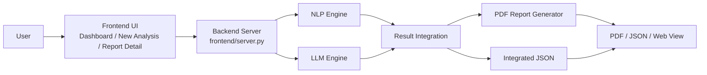

# 🤖 EduInsight AI


https://github.com/user-attachments/assets/1b0e7e18-822f-4a4a-952d-6619284a203b


강의 스크립트를 기반으로 강의 품질을 분석하고, 웹 대시보드와 PDF 리포트로 결과를 제공하는 서비스형 분석 프로젝트입니다.

이 저장소는 다음 흐름을 하나의 시스템으로 묶습니다.

- 강의 스크립트와 메타데이터 입력
- NLP 정량 분석
- LLM 정성 분석
- 결과 통합
- 웹 대시보드/상세 리포트 확인
- PDF 및 JSON 산출물 생성

## Overview

EduInsight AI는 단순히 PDF 한 장을 생성하는 도구가 아니라, 강의 품질 분석 결과를 누적 관리하고 실제 운영에 활용할 수 있도록 설계된 시스템입니다.

현재 서비스는 크게 세 화면으로 구성됩니다.

- `Dashboard`
  - 누적 리포트 조회
  - 강사 / 과정 / 기간 필터
  - 최근 리포트와 주요 지표 확인
- `New Analysis`
  - 새 강의 스크립트와 메타데이터 입력
  - 실제 분석 파이프라인 진행 상태 확인
- `Report Detail`
  - 종합 점수, 카테고리별 점수, 강점, 개선 필요 사항, 근거 확인
  - JSON / PDF 다운로드

## Key Features

- 강의 스크립트 기반 자동 품질 분석
- `NLP -> LLM -> 통합 -> 리포트` 실제 단계 기반 진행 상태 표시
- 대시보드 중심의 누적 리포트 관리
- 강의별 상세 리포트 화면 제공
- PDF 리포트 자동 생성
- 체크포인트 기반 재개
- Evidence 원문 검증
- Structured Outputs 기반 LLM 응답 구조화
- 재시도 / fallback / reliability 메타데이터 관리
- OpenAI 중심 구조 + Gemini/SQLite 확장 포인트 제공

## Service Flow

최종 서비스 흐름은 아래와 같습니다.

1. 사용자가 대시보드에서 기존 리포트를 조회하거나, 새 분석 화면으로 이동합니다.
2. 새 분석 화면에서 강의 스크립트(`.txt`)와 메타데이터를 입력해 분석을 시작합니다.
3. 시스템은 `NLP -> LLM -> 통합 -> 리포트` 순서로 파이프라인을 수행합니다.
4. 분석 완료 후 웹 화면에서 종합 점수, 카테고리별 점수, 강점, 개선 필요 사항, 분석 근거를 확인합니다.
5. 최종 산출물은 JSON과 PDF 형태로 저장되며, 웹에서 바로 다운로드할 수 있습니다.

## Architecture

시스템은 크게 프론트엔드 UI, 백엔드 서버, 분석 엔진, 데이터 저장 계층으로 구성됩니다.



### LLM Engine Structure

LLM 엔진은 계층 분리를 통해 교체 가능성과 유지보수성을 높였습니다.

- `core`
  - 스키마, 포트 인터페이스, 설정, 예외, 로깅, 메트릭, 시크릿 관리
- `application`
  - 청킹, 프롬프트, 검증, 분석 서비스, 집계 로직
- `infrastructure`
  - OpenAI / Gemini 어댑터, JSON / SQLite 저장소
- `entrypoints`
  - 배치 실행, 테스트 러너, 체크포인트 뷰어

이 구조를 기반으로 `ILLMProvider`, `IRepository` 인터페이스를 통해 LLM 연동과 저장소를 분리했습니다.

## Tech Stack

- `LLM`
  - OpenAI GPT-4o
  - Gemini 2.0 Flash
- `NLP / Text Processing`
  - Python
  - LangChain / LangChain OpenAI
  - Pandas
  - `re`
  - KoNLPy
  - Kiwipiepy
- `Pipeline / Runtime`
  - Asyncio
  - Pydantic
- `Frontend`
  - HTML
  - CSS
  - JavaScript
- `Report Generation`
  - ReportLab
  - Matplotlib
- `Validation / Matching`
  - RapidFuzz

## Repository Layout

```text
.
├─ frontend/                     # 웹 UI + 분석 API 서버
├─ src/
│  ├─ common/                    # 파일명/경로 공통 규칙
│  ├─ preprocessing/             # 입력 전처리
│  ├─ nlp_engine/                # 정량 지표 분석
│  ├─ llm_engine/                # 정성 평가 엔진
│  ├─ integration/               # NLP + LLM 결과 통합
│  ├─ reporting/                 # PDF 생성
│  └─ pipeline/                  # 통합 실행 엔트리
├─ data/
│  ├─ raw/                       # 원본 transcript
│  ├─ metadata/                  # 메타데이터 CSV
│  └─ outputs/
│     ├─ nlp/                    # NLP 결과
│     ├─ llm/                    # LLM 결과
│     ├─ integrated/             # 통합 결과
│     └─ reports/                # PDF 리포트
├─ checkpoints/                  # 청크별 저장 상태
├─ docs/                         # 문서 및 테스트 케이스
└─ README.md
```

## Output Artifacts

분석 결과는 단계별로 다음 위치에 저장됩니다.

- `data/outputs/nlp`
  - NLP 분석 결과 JSON
- `data/outputs/llm`
  - LLM 요약 결과 JSON
  - 청크별 결과 JSON
- `data/outputs/integrated`
  - 통합 분석 결과 JSON
- `data/outputs/reports`
  - 최종 PDF 리포트

웹 서비스에서도 같은 결과를 재사용합니다.

## Getting Started

### 1. Install

```bash
pip install -r requirements.txt
```

선택 기능까지 사용하려면 추가 패키지가 필요할 수 있습니다.

- Gemini 사용 시
  - `pip install google-genai`
- YAML 기반 프롬프트 버전 관리 사용 시
  - `pip install pyyaml`

### 2. Environment Variables

기본 OpenAI 경로 기준:

```env
OPENAI_API_KEY=your_openai_key
```

선택 옵션:

```env
GEMINI_API_KEY=your_gemini_key
LLM_BACKEND=gemini
LLM_CHECKPOINT_REPO=sqlite
LLM_PROMPT_VERSION=v4.3
LLM_LOG_LEVEL=INFO
LLM_LOG_FORMAT=json
```

## Run the Web App

웹 UI와 분석 API를 함께 띄우려면:

```bash
python frontend/server.py --host 127.0.0.1 --port 8000
```

브라우저 접속:

- [http://127.0.0.1:8000](http://127.0.0.1:8000)

주요 API:

- `GET /api/reports`
- `POST /api/analyze`
- `GET /api/analyze/status?job_id=...`
- `GET /api/download/json?lecture_id=...`
- `GET /api/download/pdf?lecture_id=...`

## Run the Pipeline

### End-to-end

```bash
python -m src.pipeline.run_pipeline \
  --transcript data/raw/<lecture>.txt \
  --metadata data/metadata/lecture_metadata.csv
```

### Run selected stages

```bash
python -m src.pipeline.run_pipeline \
  --run-nlp --run-llm --run-integrate --run-report \
  --transcript data/raw/<lecture>.txt \
  --metadata data/metadata/lecture_metadata.csv \
  --max-concurrency 1
```

### Validate existing artifacts only

```bash
python -m src.pipeline.run_pipeline \
  --validate-only \
  --nlp-json data/outputs/nlp/<file>.json \
  --llm-json data/outputs/llm/<file>.json \
  --analysis-json data/outputs/integrated/<file>.json \
  --metadata data/metadata/lecture_metadata.csv \
  --strict
```

## LLM Engine Utilities

배치 및 검증 보조 도구도 포함되어 있습니다.

- 배치 실행

```bash
python -m src.llm_engine.entrypoints.batch_processor --input data/raw --output data/outputs/llm
```

- 체크포인트 확인

```bash
python -m src.llm_engine.entrypoints.checkpoint_viewer --all
```

- JSONL 기반 테스트 실행

```bash
python -m src.llm_engine.entrypoints.test_runner --jsonl docs/test_cases_llm.jsonl
```

## Notes

- `OPENAI_API_KEY` 또는 `GEMINI_API_KEY`가 있어야 LLM 분석을 실행할 수 있습니다.
- 전처리 단계는 OpenAI API를 사용합니다.
- 기본 저장소는 JSON 체크포인트이며, 필요 시 SQLite 저장소로 전환할 수 있습니다.
- 프롬프트는 내장 문자열을 기본으로 사용하고, YAML 파일이 있으면 버전별로 외부 로딩할 수 있습니다.

## Roadmap

향후 확장 방향은 다음과 같습니다.

- STT API 연동을 통한 입력 자동화
- 동일 강사의 리포트 누적 비교 및 성장 추이 분석
- 의미 기반 청킹 고도화
- RAG 기반 전문 용어 보정
- 결과 캐싱 및 운영 성능 개선
- 시각화 고도화
- 추가 모델 어댑터 확장

## License

[LICENSE](LICENSE)
